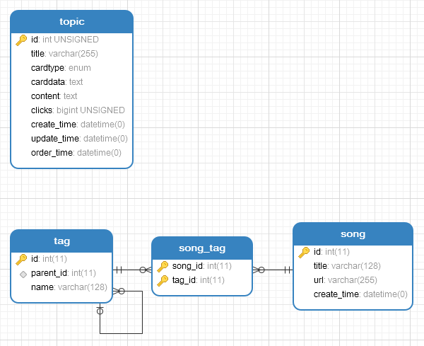

# .NETCore 2.1 + Mysql 生成器

作者面向web应用开发13年，在项目实践与学习中去旧换新，吸取优点，从高质量、强规范、快速开发方向累积，形成生成器工具减少项目后端开发难度。

> navicat 模型工具创建和管理ER图，从数据库导入/同步结构到数据库，后使用本生成器一键同步c#实体，以及各种规范的花式和你想象不到的语法，支持缓存，支持数据库99%类型，挖掘数据库特性，避免过多重复劳动和不规范、不健壮的代码。

优势：
 * 1、根据主键、唯一键、外键（1对1，1对多，多对多）生成功能丰富的数据库 SDK；
 * 2、严格把控数据库，避免随意创建表或字段，有标准的ER图数据库规范；
 * 3、统一规范数据库操作类与方法(相比EF太随意的用法好管理很多)，一条心堆业务；
 * 4、优化每一个细节，决不允许低级错误干扰我们的业务逻辑(相比ORM，生成的代码更专注)；

适合场境：
 * 1、新项目开发，只管设计数据ER图，无须考虑db相关代码；
 * 2、老项目数据库访问方式不堪入目的，表数量越多收益越大；

[下载生成器winform客户端](https://files.cnblogs.com/files/kellynic/%E7%94%9F%E6%88%90%E5%99%A8mysql.zip)，或者安装命令工具 dotnet tool install -g GenMy

新人指导教学链接：https://pan.baidu.com/s/1gx8ClLF7AzL06j2D43kBWQ 密码：lr6n

学习QQ群：8578575

----

## 在已有的项目上生成

```shell
dotnet new mvc
GenMy 数据库ip[:3306] -U 登陆名 -P 密码 -D 数据库1[,数据库2] -N 命名空间
```

## 生成完整的模块化解决方案

```shell
GenMy 数据库ip[:3306] -U 登陆名 -P 密码 -D 数据库1[,数据库2] -N 命名空间 -R -S -A
```

dotnetGen 保持相同的开发与使用习惯，现实了面向 mysql、SQLServer、PostgreSQL 三种数据库快速开发，也可混合使用。

| <font color=gray>功能对比</font> | [dotnetGen_mysql](https://github.com/2881099/dotnetGen_mysql) | [dotnetGen_sqlserver](https://github.com/2881099/dotnetGen_sqlserver) | [dotnetGen_postgresql](https://github.com/2881099/dotnetGen_postgresql) |
| ----------------: | --------------: | -------------------: | -------------------: |
| windows            | √ | √ | √ |
| linux              | √ | √ | √ |
| 连接池             | √ | √ | √ |
| 事务               | √ | √ | √ |
| 多数据库            | √ | - | - |
| 读写分离            | √ | √ | √ |
| 表                 | √ | √ | √ |
| 表关系(1对1)        | √ | √ | √ |
| 表关系(1对多)       | √ | √ | √ |
| 表关系(多对多)      | √ | √ | √ |
| 表主键             | √ | √ | √ |
| 表唯一键           | √ | √ | √ |
| 存储过程           | - | √ | - |
| 视图               | √ | √ | √ |
| 软删除             | √ | √ | √ |
| 类型映射           | √ | √ | √ |
| 枚举               | √ | - | √ |
| 自定义类型         | - | - | √ |
| gis               | √ | - | √ |
| 数组               | - | - | √ |
| 字典               | - | - | √ |
| xml               | - | - | - |
| json              | - | - | √ |
| 缓存               | √ | √ | √ |
| 命令行生成         | √ | √ | √ |
| RESTful           | √ | √ | √ |
| 后台管理功能       | √ | √ | √ |


### 测试数据库



```sql
SET FOREIGN_KEY_CHECKS=0;

-- ----------------------------
-- Table structure for song
-- ----------------------------
DROP TABLE IF EXISTS `song`;
CREATE TABLE `song` (
  `id` int(11) NOT NULL AUTO_INCREMENT,
  `title` varchar(128) COLLATE utf8_unicode_ci DEFAULT NULL COMMENT '歌名',
  `url` varchar(255) COLLATE utf8_unicode_ci DEFAULT NULL COMMENT '地址',
  `create_time` datetime DEFAULT NULL COMMENT '创建时间',
  PRIMARY KEY (`id`)
) ENGINE=InnoDB AUTO_INCREMENT=2 DEFAULT CHARSET=utf8 COLLATE=utf8_unicode_ci;

-- ----------------------------
-- Table structure for song_tag
-- ----------------------------
DROP TABLE IF EXISTS `song_tag`;
CREATE TABLE `song_tag` (
  `song_id` int(11) NOT NULL COMMENT '歌曲',
  `tag_id` int(11) NOT NULL COMMENT '标签',
  PRIMARY KEY (`song_id`,`tag_id`),
  KEY `fk_song_tag_tag_1` (`tag_id`),
  CONSTRAINT `fk_song_tag_song_1` FOREIGN KEY (`song_id`) REFERENCES `song` (`id`) ON DELETE NO ACTION ON UPDATE NO ACTION,
  CONSTRAINT `fk_song_tag_tag_1` FOREIGN KEY (`tag_id`) REFERENCES `tag` (`id`) ON DELETE NO ACTION ON UPDATE NO ACTION
) ENGINE=InnoDB DEFAULT CHARSET=utf8 COLLATE=utf8_unicode_ci;

-- ----------------------------
-- Table structure for tag
-- ----------------------------
DROP TABLE IF EXISTS `tag`;
CREATE TABLE `tag` (
  `id` int(11) NOT NULL AUTO_INCREMENT,
  `parent_id` int(11) DEFAULT NULL COMMENT '父标签',
  `name` varchar(128) COLLATE utf8_unicode_ci DEFAULT NULL COMMENT '名称',
  PRIMARY KEY (`id`),
  KEY `fk_tag_tag_1` (`parent_id`),
  CONSTRAINT `fk_tag_tag_1` FOREIGN KEY (`parent_id`) REFERENCES `tag` (`id`) ON DELETE NO ACTION ON UPDATE NO ACTION
) ENGINE=InnoDB AUTO_INCREMENT=3 DEFAULT CHARSET=utf8 COLLATE=utf8_unicode_ci;

-- ----------------------------
-- Table structure for topic
-- ----------------------------
DROP TABLE IF EXISTS `topic`;
CREATE TABLE `topic` (
  `id` int(10) unsigned NOT NULL AUTO_INCREMENT,
  `title` varchar(255) DEFAULT NULL COMMENT '标题',
  `cardtype` enum('视频','图文01','图文02','链接') DEFAULT NULL COMMENT '卡片类型',
  `carddata` text COMMENT '卡片渲染数据',
  `content` text COMMENT '内容',
  `clicks` bigint(20) unsigned DEFAULT NULL COMMENT '点击次数',
  `create_time` datetime DEFAULT NULL COMMENT '创建时间',
  `update_time` datetime DEFAULT NULL COMMENT '修改时间',
  `order_time` datetime DEFAULT NULL COMMENT '排序时间',
  PRIMARY KEY (`id`)
) ENGINE=InnoDB DEFAULT CHARSET=utf8;
```


# 模块化框架目录结构介绍

## Module

	所有业务接口约定在 Module 划分并行开发，互不依赖

	Module/Admin
	生成的后台管理模块，http://localhost:5001/module/Admin 可访问

	Module/Test
	生成的测试模块

## WebHost

	WebHost 编译的时候，会将 Module/* 编译结果复制到当前目录
	WebHost 只当做主引擎运行时按需加载相应的 Module
	WebHost 依赖 npm ，请安装 node，并在目录执行 npm install
	WebHost 依赖 gulp-cli，请执行全局安装 npm install --global gulp-cli
	运行步骤：
    1、打开 vs 右击 Module 目录全部编译；
    2、cd WebHost && npm install && dotnet build && dotnet run

## Infrastructure

	Module 里面每个子模块的依赖所需

#### xx.db

	包含一切数据库操作的封装
	xx.Model(实体映射)
	xx.BLL(静态方法封装)
	xx.DAL(数据访问)
	生成名特征取数据库名首字母大写(如: 表 test 对应 xx.Model.TestInfo、xx.BLL.Test、xx.DAL.Test)

	数据库设计命名习惯：所有命名(username, stats_click)、外键字段(user_id)
	仅支持主键作为外键，不支持组合字段，不支持唯一键作为外键
	修改数据库后，双击“./GenMy只更新db.bat”可快速覆盖，所有类都使用 partial，方便扩展亦不会被二次生成覆盖

# 数据库相关方法

## 添加记录

```csharp
// 如有 create_time 字段并且类型为日期，内部会初始化
TestInfo newitem1 = Test.Insert(Title: "添加的标题", Content: "这是一段添加的内容");
TestInfo newitem2 = Test.Insert(new TestInfo { Title = "添加的标题", Content = "这是一段添加的内容" });
```

## 添加记录(批量)

```csharp
List<TestInfo> newitems1 = Test.Insert(new [] {
	new TestInfo { Title = "添加的标题1", Content = "这是一段添加的内容1" },
	new TestInfo { Title = "添加的标题2", Content = "这是一段添加的内容2" }
});
```

## 更新记录

```csharp
// 更新 id = 1 所有字段
Test.Update(new TestInfo { Id: 1, Title = "添加的标题", Content = "这是一段添加的内容", Clicks = 1 });
// 更新 id = 1 指定字段
Test.UpdateDiy(1).SetTitle("修改后的标题").SetContent("修改后的内容").SetClicks(1).ExecuteNonQuery();
// update 表名 set clicks = clicks + 1 where id = 1
Test.UpdateDiy(1).SetClicksIncrement(1).ExecuteNonQuery();
// 使用实体层修改
new TestInfo { Id = 1 }.UpdateDiy.SetClicksIncrement(1).ExecuteNonQuery();
```

## 更新记录(批量)

```csharp
//先查找 clicks 在 0 - 100 的记录
List<TestInfo> newitems1 = Test.Select.WhereClicksRange(0, 100).ToList();
// update 表名 set clicks = clicks + 1 where id in (newitems1所有id)
newitems1.UpdateDiy().SetClicksIncrement(1).ExecuteNonQuery();
```

> 警告：批量更新的方法，在事务中使用会导致死锁

## 删除记录

```csharp
// 删除 id = 1 的记录
Test.Delete(1);
```

## 按主键/唯一键获取单条记录

> appsettings可配置缓存时间，以上所有增、改、删都会删除缓存保障同步

```csharp
//按主键获取
UserInfo user1 = User.GetItem(1);
//按唯一键
UserInfo user2 = User.GetItemByUsername("2881099@qq.com");
// 返回 null 或 UserInfo
```

## 查询(核心)

```csharp
//BLL.表名.Select 是一个链式查询对象，几乎支持所有查询，包括 group by、inner join等等，最终 ToList ToOne Aggregate 执行 sql
List<UserInfo> users1 = User.Select.WhereUsername("2881099@qq.com").WherePassword("******").WhereStatus(正常).ToList();
//返回 new List<UserInfo>() 或 有元素的 List，永不返回 null

//返回指定列，返回List<元组>
var users2 = User.Select.WhereStatus(正常).Aggregate<(int id, string title)>("id,title");

//多表查询，只返回 a 表字段
var users3 = User.Select.From<User_group>("b").Where("a.group_id = b.id").ToList();

//join查询，返回 a, b 表字段 ，b 表结果填充至 a.Obj_user_group 对象，类似 ef.Include
var users4 = User.Select.InnerJoin<User_group>("b", "a.group_id = b.id").ToList();

//分组查询
var users5 = User.Select.GroupBy("group_id").Aggregate<(int groupId, int count)>("group_id, count(1)");

//等等...
```

## 事务

```csharp
//错误会回滚，事务内支持所有生成的同步方法（不支持生成对应的Async方法）
var user = User.GetItem(1);
SqlHelper.Transaction(() => {
	if (user.UpdateDiy.SetAmountIncrement(-num).Where("amount > {0}", num).ExecuteNonQuery() <= 0)
		throw new Exception("余额不足");

	var order = user.AddOrder(Amount: 1, Count: num, Count_off: num);
});
```

## 缓存

1、根据主键、唯一键缓存

BLL GetItem、GetItemBy唯一键，使用了默认缓存策略180秒，用来缓存一条记录，db 层自动维护缓存同步，例如：

```csharp
//只有第一次查询了数据库，后面99次读取redis的缓存值
UserInfo u;
for (var a = 0; a < 100; a++)
	u = User.GetItemByUsername("2881099@qq.com");

//执行类似以下的数据变动方法，会删除redis对应的缓存
u.UpdateDiy.SetLogin_time(DateTime.Now).ExecuteNonQuery();
```

2、缓存一个查询结果

BLL Select.ToList(10, "cache_key")，将查询结果缓存10秒，需要手工删除redis对应的键

## 读写分离

内置现实读和写分离，一个【主库】多个【从库】，【从库】的查询策略为随机方式。

若某【从库】发生故障，将切换到其他可用【从库】，若已全部不可用则使用【主库】查询。

出现故障【从库】被隔离起来间隔性的检查可用状态，以待恢复。

```csharp
Topic.Select.WhereId(1).ToOne(); //读【从库】（默认）
Topic.Select.Master().WhereId(1).ToOne(); //读【主库】
```

#### 测试

> 

> 

> 


# 生成规则

## 不会生成

* 没有主键，不会生成 增、改、删 方法
* 有自增字段，不会生成 批量 Insert 方法

## 特别规则

* 字段类型 point，会生成
	> 表.Select.Where字段MbrContains(查找地理位置多少米范围内的记录，距离由近到远排序)
* 字段类型 string 相关并且长度 <= 300，会生成
	> 表.Select.Where字段Like
* 99%的数据类型被支持